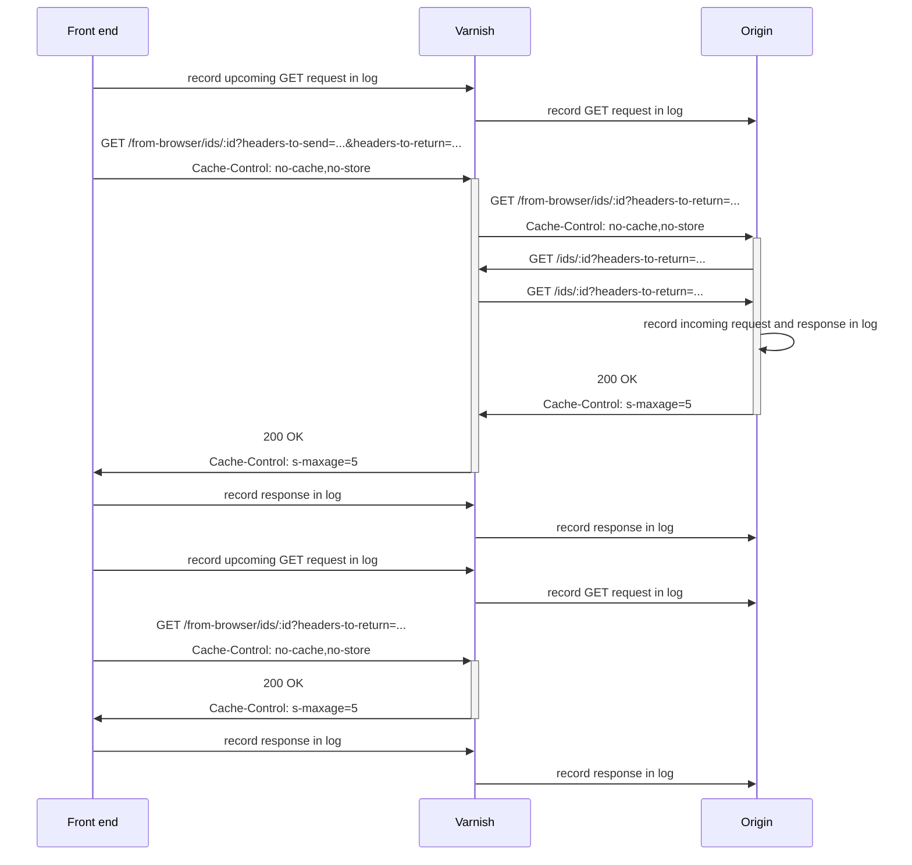

# Architecture

(These notes are incomplete.)

The diagram below shows the front end making two subsequent requests, the second of which results in a cached response being served.

The origin server has two main endpoints: and `/from-browser/ids/:id` and `/ids/:id`. The former proxies requests to the latter after removing the request headers sent by the browser and instead using those that are encoded in `headers-to-send`. The `/ids/:id` endpoint returns headers that are encoded in `headers-to-return`.

The front end is able to retrieve the interaction log from the origin (which keeps it in memory) and render it as a sequence diagram.